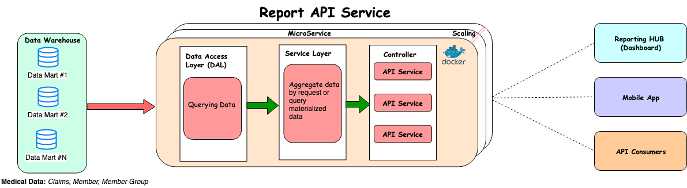

### Introduction
Reporting apis is micro service to serve the reporting data to the consumers.

### Getting Started
To set up, build and run poc application in LOCAL environment.
1.	Clone or download project
2.	Open Project reporting-apis in IntelliJ/Eclipse
3.  For lombok plugin configuration please follow steps https://www.baeldung.com/lombok-ide
3.	Build ``` ./gradlew clean build ```
4.	Run the application by right click  ReportingApplication class
    OR using gradle command  ``` ./gradlew bootRun ```

### Endpoint Information
Swagger Documentation : http://localhost:8085/swagger-ui.html
- Health Check:
```
 Heart beat end point :
    GET -> http://localhost:8086/reportingdata/heartbeat
    Headers -> "Content-Type":"application/json"
               "Accept-Charset":"UTF-8"
```
### Architecture flow for reporting-api
## 

### Jar file execution option 2 run application
 - Open command line prompt
 - Go to (cd to) project folder
 - Go to build/libs directory
 - execute command  ``` java -jar reporting-apis.jar ```
 - http://localhost:8085/swagger-ui.html

### Docker Option 2 run application
 - To build docker image from docker file
   ``` docker build -t reporting-apis .```
 - To run created docker image  ``` docker run -p 8086:8086 -t reporting-apis ```
 - http://localhost:8086/swagger-ui.html

### Contribute
Ravi Reddy (Ravinder Nancherla)

### License
@CopyRight ( C ) All rights reserved to E&A Team. It's Illegal to reproduce this code.
[Ravi Reddy](https://www.linkedin.com/in/ravireddy55447/)
